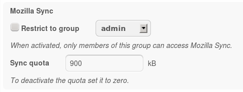

#
# FILE DISCONTINUED HERE
# UPDATED VERSION AT
#         https://gitlab.com/yeupou/stalag13/raw/master/usr/share/owncloud/apps/mozilla_sync/docs/ADMIN.md
#
#                                 |     |
#                                 \_V_//
#                                 \/=|=\/
#                                  [=v=]
#                                __\___/_____
#                               /..[  _____  ]
#                              /_  [ [  M /] ]
#                             /../.[ [ M /@] ]
#                            <-->[_[ [M /@/] ]
#                           /../ [.[ [ /@/ ] ]
#      _________________]\ /__/  [_[ [/@/ C] ]
#     <_________________>>0---]  [=\ \@/ C / /
#        ___      ___   ]/000o   /__\ \ C / /
#           \    /              /....\ \_/ /
#        ....\||/....           [___/=\___/
#       .    .  .    .          [...] [...]
#      .      ..      .         [___/ \___]
#      .    0 .. 0    .         <---> <--->
#   /\/\.    .  .    ./\/\      [..]   [..]
#
Admin Manual
============

The admin settings for the Mozilla Sync app look like this:

There are two settings:

1. *Restrict to group* controls the access to the Mozilla Sync app.
2. *Sync quota* limits the data that can be stored on the server per user.
