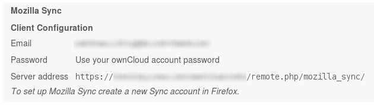

#
# FILE DISCONTINUED HERE
# UPDATED VERSION AT
#         https://gitlab.com/yeupou/stalag13/raw/master/usr/share/owncloud/apps/mozilla_sync/docs/USER.md
#
#                                 |     |
#                                 \_V_//
#                                 \/=|=\/
#                                  [=v=]
#                                __\___/_____
#                               /..[  _____  ]
#                              /_  [ [  M /] ]
#                             /../.[ [ M /@] ]
#                            <-->[_[ [M /@/] ]
#                           /../ [.[ [ /@/ ] ]
#      _________________]\ /__/  [_[ [/@/ C] ]
#     <_________________>>0---]  [=\ \@/ C / /
#        ___      ___   ]/000o   /__\ \ C / /
#           \    /              /....\ \_/ /
#        ....\||/....           [___/=\___/
#       .    .  .    .          [...] [...]
#      .      ..      .         [___/ \___]
#      .    0 .. 0    .         <---> <--->
#   /\/\.    .  .    ./\/\      [..]   [..]
#
User Manual
===========

Before Sync set up
------------------
Before Sync is set up your personal settings in ownCloud will look like this:

It shows your client configuration which has to be typed in when setting up Sync for the first time.

After Sync set up
-----------------
If you completed the Sync set up, the personal page will look like this:

The new section *Sync Status* means that the set up succeeded and shows some additional data.
Furthermore, you get the *Delete storage* button. This will remove all your data from the server and delete your Sync user. Deleting all the data will not inform your paired devices and they will be in an incosistent state.
